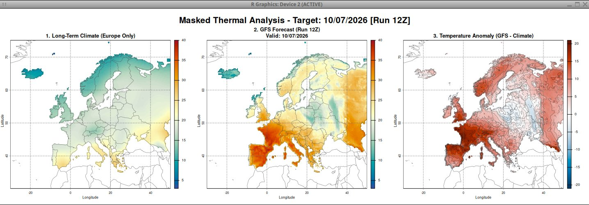

# 2m-anomalies-europe

A robust, interactive R script to fetch, process, and map 2-meter thermal anomalies across the European continent using real-time GFS (Global Forecast System) model data and long-term historical climatology.

---

## 📊 Visual Outputs

The pipeline processes global meteorological grids and slices them down to the European domain. Below is a comparison between the standard regional grid and the finalized politcally-masked landmass output:

### 1. Raw Bounding Box Analysis
Initially, the script crops the GFS and Climatology data to a macro European bounding box, which naturally includes parts of North Africa and the Atlantic Ocean:


### 2. Masked Landmass Analysis (Final Output)
By applying a strict political boundary vector, the script filters out marine areas and neighboring continents to isolate and analyze the European territory exclusively:



---

## 🎛️ Key Features

* **Interactive Run Selection:** Choose between all 8 daily GFS cycle runs (00Z, 03Z, 06Z, 09Z, 12Z, 15Z, 18Z, 21Z) straight from the R console.
* **Smart Fallback Architecture (XyGrib Style):** If NOAA servers are currently uploading data or a specific run is incomplete, the script automatically shifts backwards to the closest available historical run and compensates the forecast hours to keep the map target accurate without crashing.
* **Seamless Coordinate Rotation:** Handles native 0-360° GFS coordinate wrapping, flawlessly binding the Iberian Peninsula and Atlantic boundaries to standard -180° to +180° projections.
* **Strict European Masking:** Leverages spatial political boundaries to filter out ocean data and neighboring continents (e.g., North Africa, Middle East), displaying data exclusively over the European landmass.
* **Automated Extreme Metrics:** Computes and prints a concise text-based terminal report showing forecasted European maximum/minimum temperatures, historical records, and exact peak positive/negative anomalies.

---

## 🛠️ Prerequisites & Installation

Ensure you have R installed along with the following required geospatial libraries:

```R
install.packages(c("terra", "sf", "maps"))


## 🚀 How to Run

    Clone this repository or download the main script.

    Open your terminal or R console and source the file:
	
    source("2m_anomalies_europe.R")

---